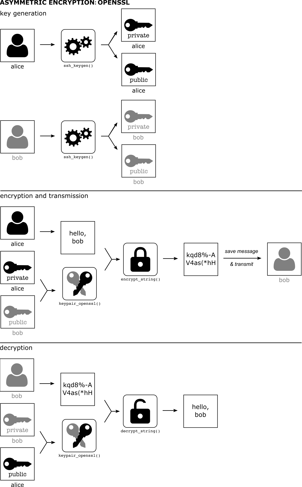

This package tries to smooth over some of the differences in
encryption approaches (symmetric vs. asymmetric, sodium vs. openssl)
to provide a simple interface for users who just want to encrypt or
decrypt things.

The scope of the package is to protect data that has been saved to
disk.  It is not designed to stop an attacker targeting the R
process itself to determine the contents of sensitive data.  The
package does try to prevent you accidentally saving to disk the
contents of sensitive information, including the keys that could
decrypt such information.

This vignette works through the basic functionality of the package.
It does not offer much in the way of an introduction to encryption
itself; for that see the excellent vignettes in the `openssl` and
`sodium` packages (see `vignette("crypto101")` and
`vignette("bignum")` for information about how encryption works).
This package is a wrapper around those packages in order to make
them more accessible.

# Keys and the like

To encrypt anything we need a key.  There are two sorts of key
"types" we will concern ourselves with here "symmetric" and
"asymmetric".

* "symmetric" keys are used for storing secrets that multiple
  people need to access.  Everyone has the same key (which is just
  a bunch of bytes) and with that we can either encrypt data or
  decrypt it.

* a "key pair" is a public and a private key; this is used in
  communication.  You hold a private key that nobody else ever sees
  and a public key that you can copy around all over the show.
  These can be used for a couple of different patterns of
  communication (see below).

We support symmetric keys and asymmetric key pairs from the
`openssl` and `sodium` packages (which wrap around
industry-standard cryptographic libraries) - this vignette will
show how to create and load keys of different types as they're
used.

The `openssl` keys have the advantage of a standard key format, and
that many people (especially on Linux and macOS) have a keypair
already (see below if you're not sure if you do).  The `sodium`
keys have the advantage of being a new library, starting from a
clean slate rather than carrying with it accumulated ideas from the
last 20 years of development.

The idea in `cyphr` is that we can abstract away some differences
in the types of keys and the functions that go with them to create
a standardised interface to encrypting and decrypting strings, R
objects, files and raw vectors.  With that, we can then create
wrappers around functions that create files and simplify the
process of adding encryption into a data workflow.

Below, I'll describe the sorts of keys that `cyphr` supports and in
the sections following describe how these can be used to actually
do some encryption.

## Symmetric encryption


This is the simplest form of encryption because everyone has the
same key (like a key to your house or a single password).  This
raises issues (like how do you *store* the key without other people
reading it) but we can deal with that below.

### `openssl`

To generate a key with `openssl`, you can use:
``` {r }
k <- openssl::aes_keygen()
```

which generates a raw vector
``` {r }
k
```

(this prints nicely but it really is stored as a 16 byte raw
vector).

The encryption functions that this key supports are
`openssl::aes_cbc_encrypt`, `openssl::aes_ctr_encrypt` and
`openssl::aes_gcm_encrypt` (along with the corresponding decryption
functions).  The `cyphr` package tries to abstract this away by
using a wrapper `cyphr::key_openssl
``` {r }
key <- cyphr::key_openssl(k)
key
```

With this key, one can encrypt a string with `cyphr::encrypt_string`:
``` {r }
secret <- cyphr::encrypt_string("my secret string", key)
```

and decrypt it again with `cyphr::decrypt_string`:
``` {r }
cyphr::decrypt_string(secret, key)
```

See below for more functions that use these key objects.

### `sodium`

The interface is almost identical using sodium symmetric keys.  To
generate a symmetric key with libsodium you would use
`sodium::keygen`
``` {r }
k <- sodium::keygen()
```

This is really just a raw vector of length 32, without even any
class attribute!

The encryption functions that this key supports are
`sodium::data_encrypt` and `sodium::data_decrypt`.  To create a key
for use with `cyphr` that knows this, use:
``` {r }
key <- cyphr::key_sodium(k)
key
```

This key can then be used with the high-level cyphr encryption
functions described below.

## Asymmetric encryption ("key pairs")



With asymmetric encryption everybody has two keys that differ from
everyone else's key.  One key is public and can be shared freely
with anyone you would like to communicate with and the other is
private and must never be disclosed.

In the `sodium` package there is a vignette
(`vignette("crypto101")`) that gives a gentle introduction to how
this all works.  In practice, you end up creating a pair of keys
for yourself.  Then to encrypt or decrypt something you encrypt
messages with the recipient's *public key* and they (and only they)
can decrypt it with their *private key*.

One use for asymmetric encryption is to encrypt a shared secret
(such as a symmetric key) - with this you can then safely store or
communicate a symmetric key without disclosing it.

### `openssl`

Let's suppose that we have two parties "Alice" and "Bob" who want
to talk with one another.  For demonstration purposes we need to
generate SSH keys (with no password) in temporary directories (to
comply with CRAN policies).  In a real situation these would be on
different machines (Alice has no access to Bob's key!) and these
keys would be password protected.
``` {r }
path_key_alice <- cyphr::ssh_keygen(password = FALSE)
path_key_bob <- cyphr::ssh_keygen(password = FALSE)
```

Note that each directory contains a public key (`id_rsa.pub`) and a
private key (`id_rsa`).
``` {r }
dir(path_key_alice)
dir(path_key_bob)
```

Below, the full path to the key (e.g., `.../id_rsa`) could be
used in place of the directory name if you prefer.

If Alice wants to send a message to Bob she needs to use her
private key and his public key
``` {r }
pair_a <- cyphr::keypair_openssl(path_key_bob, path_key_alice)
pair_a
```

with this pair she can write a message to "bob":
``` {r }
secret <- cyphr::encrypt_string("secret message", pair_a)
```

The secret is now just a big pile of bytes
``` {r }
secret
```

Note that unlike symmetric encryption above, Alice cannot decrypt
her own message:
``` {r error = TRUE}
cyphr::decrypt_string(secret, pair_a)
```

For Bob to read the message, he uses his private key and Alice's
public key (which she has transmitted to him previously).
``` {r }
pair_b <- cyphr::keypair_openssl(path_key_alice, path_key_bob)
```

With this keypair, Bob can decrypt Alice's message
``` {r }
cyphr::decrypt_string(secret, pair_b)
```

And send one back of his own:
``` {r }
secret2 <- cyphr::encrypt_string("another message", pair_b)
secret2
```

which she can decrypt
``` {r }
cyphr::decrypt_string(secret2, pair_a)
```

Chances are, you have an openssl keypair in your `.ssh/` directory.
If so, you would pass `NULL` as the path for the private (or less
usefully, the public) key pair part.  So to send a message to Bob,
we'd include the path to Bob's public key.
```r
pair_us <- cyphr::keypair_openssl(path_key_bob, NULL)
```

This all skips over how Alice and Bob will exchange this secret
information.  Because the secret is bytes, it's a bit odd to work
with.  Alice could save the secret to disk with
``` {r }
secret <- cyphr::encrypt_string("secret message", pair_a)
path_for_bob <- file.path(tempdir(), "for_bob_only")
writeBin(secret, path_for_bob)
```

And then send Bob the file `for_bob_only` (over email or any other
insecure medium).

and bob could read the secret in with:
``` {r }
secret <- readBin(path_for_bob, raw(), file.size(path_for_bob))
cyphr::decrypt_string(secret, pair_b)
```

As an alternative, you can "base64 encode" the bytes into something
that you can just email around:
``` {r }
secret_base64 <- openssl::base64_encode(secret)
secret_base64
```

This can be converted back with `openssl::base64_decode`:
``` {r }
identical(openssl::base64_decode(secret_base64), secret)
```

Or, less compactly but also suitable for email, you might just
convert the bytes into their hex representation:
``` {r }
secret_hex <- sodium::bin2hex(secret)
secret_hex
```

and the reverse with `sodium::hex2bin`:
``` {r }
identical(sodium::hex2bin(secret_hex), secret)
```

(this is somewhat less space efficient than base64 encoding.

As a final option, you can just save the secret with `saveRDS` and
read it in with `readRDS` like any other option.  This will be the
best route if the secret is saved into a more complicated R object
(e.g., a list or `data.frame`).

See the other cyphr vignette (`vignette("data", package =
"cyphr")`) for a suggested workflow for exchanging secrets within a
team, and the wrapper functions below for more convenient ways of
working with encrypted data.

**Do you already have an ssh keypair?** To find out, run

```r
cyphr::keypair_openssl(NULL, NULL)
```

One of three things will happen:

1. you will be prompted for your password to decrypt your private
key, and then after entering it an object `<cyphr_keypair:
openssl>` will be returned - you're good to go!

2. you were _not_ prompted for your password, but got a
`<cyphr_keypair: openssl>` object.  You should consider whether
this is appropriate and consider generating a new keypair with the
private key encrypted.  If you don't then anyone who can read your
private key can decrypt any message intended for you.

3. you get an error like `Did not find default ssh public key at
~/.ssh/id_rsa.pub`.  You need to create a keypair.

To create a keypair, you can use the `cyphr::ssh_keygen()` function as

```r
cyphr::ssh_keygen("~/.ssh")
```

This will create the keypair as `~/.ssh/id_rsa` and
`~/.ssh/id_rsa.pub`, which is where `cyphr` will look for your keys
by default.  See `?ssh_keygen` for more information.  (On Linux and
macOS you might use the `ssh-keygen` command line utility.  On
windows, PuTTY` has a utility for creating keys.)

### `sodium`

With `sodium`, things are largely the same with the exception that
there is no standard format for saving sodium keys.  The bits below
use an in-memory key (which is just a collection of bytes) but
these can also be filenames, each of which contains the contents of
the key written out with `writeBin`.

First, generate keys for Alice:
``` {r }
key_a <- sodium::keygen()
pub_a <- sodium::pubkey(key_a)
```

the public key is derived from the private key, and Alice can share
that with Bob.  We next generate Bob's keys
``` {r }
key_b <- sodium::keygen()
pub_b <- sodium::pubkey(key_b)
```

Bob would now share is public key with Alice.

If Alice wants to send a message to Bob she again uses her private
key and Bob's public key:
``` {r }
pair_a <- cyphr::keypair_sodium(pub_b, key_a)
```

As above, she can now send a message:
``` {r }
secret <- cyphr::encrypt_string("secret message", pair_a)
secret
```

Note how this line is identical to the one in the `openssl` section.

To decrypt this message, Bob would use Alice's public key and his
private key:
``` {r }
pair_b <- cyphr::keypair_sodium(pub_a, key_b)
cyphr::decrypt_string(secret, pair_b)
```

# Encrypting things

Above, we used `cyphr::encrypt_string` and `cyphr::decrypt_string`
to encrypt and decrypt a string.  There are several such functions
in the package that encrypt and decrypt

* R objects `encrypt_object` / `decrypt_object` (using serialization
  and deserialization)
* strings: `encrypt_string` / `decrypt_string`
* raw vectors: `encrypt_data` / `decrypt_data`
* files: `encrypt_file` / `decrypt_file`

For this section we will just use a sodium symmetric encryption
key
``` {r }
key <- cyphr::key_sodium(sodium::keygen())
```

For the examples below, in the case of asymmetric encryption (using
either `cyphr::keypair_openssl` or `cyphr::keypair_sodium`) the
sender would use their private key and the recipient's public key
and the recipient would use the complementary key pair.

## Objects

Here's an object to encrypt:
``` {r }
obj <- list(x = 1:10, y = "secret")
```

This creates a bunch of raw bytes corresponding to the data (it's
not really possible to print this as anything nicer than bytes).
``` {r }
secret <- cyphr::encrypt_object(obj, key)
secret
```

The data can be decrypted with the `decrypt_object` function:
``` {r }
cyphr::decrypt_object(secret, key)
```

Optionally, this process can go via a file, using a third argument
to the functions (note that temporary files are used here for
compliance with CRAN policies - any path may be used in practice).
``` {r }
path_secret <- file.path(tempdir(), "secret.rds")
cyphr::encrypt_object(obj, key, path_secret)
```

There is now a file called `secret.rds` in the temporary directory:
``` {r }
file.exists(path_secret)
```

though it is not actually an rds file:
``` {r error = TRUE}
readRDS(path_secret)
```

When passed a filename (as opposed to a raw vector),
`cyphr::decrypt_object` will read the object in before decrypting
it
``` {r }
cyphr::decrypt_object(path_secret, key)
```

## Strings

For the case of strings we can do this in a slightly more
lightweight way (the above function routes through `serialize` /
`deserialize` which can be slow and will create larger objects than
using `charToRaw` / `rawToChar`)
``` {r }
secret <- cyphr::encrypt_string("secret", key)
secret
```

and decrypt:
``` {r }
cyphr::decrypt_string(secret, key)
```

## Plain raw data

If these are not enough for you, you can work directly with raw
objects (bunches of bytes) by using `encrypt_data`:
``` {r }
dat <- sodium::random(100)
dat # some random bytes

secret <- cyphr::encrypt_data(dat, key)
secret
```

Decrypted data is the same as a the original data
``` {r }
identical(cyphr::decrypt_data(secret, key), dat)
```

## Files

Suppose we have written a file that we want to encrypt to send to
someone (in a temporary directory for compliance with CRAN
policies)
``` {r }
path_data_csv <- file.path(tempdir(), "iris.csv")
write.csv(iris, path_data_csv, row.names = FALSE)
```

You can encrypt that file with
``` {r }
path_data_enc <- file.path(tempdir(), "iris.csv.enc")
cyphr::encrypt_file(path_data_csv, key, path_data_enc)
```

This encrypted file can then be decrypted with
``` {r }
path_data_decrypted <- file.path(tempdir(), "idis2.csv")
cyphr::decrypt_file(path_data_enc, key, path_data_decrypted)
```

Which is identical to the original:
``` {r }
tools::md5sum(c(path_data_csv, path_data_decrypted))
```

# An even higher level interface for files

This is the most user-friendly way of using the package when the
aim is to encrypt and decrypt files.  The package provides a pair
of functions `cyphr::encrypt` and `cyphr::decrypt` that wrap file
writing and file reading functions.  In general you would use
`encrypt` when writing a file and `decrypt` when reading one.
They're designed to be used like so:

Suppose you have a super-secret object that you want to share privately
``` {r }
key <- cyphr::key_sodium(sodium::keygen())
x <- list(a = 1:10, b = "don't tell anyone else")
```

If you save `x` to disk with `saveRDS` it will be readable by
everyone until it is deleted.  But if you encrypted the file that
`saveRDS` produced it would be protected and only people with the
key can read it:
``` {r }
path_object <- file.path(tempdir(), "secret.rds")
cyphr::encrypt(saveRDS(x, path_object), key)
```

(see below for some more details on how this works).

This file cannot be read with `readRDS`:

``` {r error = TRUE}
readRDS(path_object)
```

but if we wrap the call with `decrypt` and pass in the config
object it can be decrypted and read:
``` {r }
cyphr::decrypt(readRDS(path_object), key)
```

What happens in the call above is `cyphr` uses "non standard
evaluation" to rewrite the call above so that it becomes
(approximately)

1. use `cyphr::decrypt_file` to decrypt "secret.rds" as a temporary file
2. call `readRDS` on that temporary file
3. delete the temporary file (even if there is an error in the above calls)

This non-standard evaluation breaks referential integrity (so may
not be suitable for programming).  You can always do this manually
with `encrypt_file` / `decrypt_file` so long as you make sure to
clean up after yourself.

The `encrypt` function inspects the call in the first argument
passed to it and works out for the function provided (`saveRDS`)
which argument corresponds to the filename (here `"secret.rds"`).
It then rewrites the call to write out to a temporary file (using
`tempfile()`).  Then it calls `encrypt_file` (see below) on this
temporary file to create the file asked for (`"secret.rds"`).  Then
it deletes the temporary file, though this will also happen in case
of an error in any of the above.

The `decrypt` function works similarly.  It inspects the call and
detects that the first argument represents the filename.  It
decrypts that file to create a temporary file, and then runs
`readRDS` on that file.  Again it will delete the temporary file on
exit.

The functions supported via this interface are:

* `readLines` / `writeLines`
* `readRDS` / `writeRDS`
* `read` / `save`
* `read.table` / `write.table`
* `read.csv` / `read.csv2` / `write.csv`
* `read.delim` / `read.delim2`

But new functions can be added with the `rewrite_register`
function.  For example, to support the excellent
[rio](https://cran.r-project.org/package=rio) package, whose
`import` and `export` functions take the filename `file` you could
use:

```r
cyphr::rewrite_register("rio", "import", "file")
cyphr::rewrite_register("rio", "export", "file")
```

now you can read and write tabular data into and out of a great
many different file formats with encryption with calls like

```r
cyphr::encrypt(rio::export(mtcars, "file.json"), key)
cyphr::decrypt(rio::import("file.json"), key)
```

The functions above use [non standard evaluation](http://adv-r.had.co.nz/Computing-on-the-language.html)
and so may not be suitable for programming or use in packages.  An
"escape hatch" is provided via `encrypt_` and `decrypt_` where the
first argument is a quoted expression.
``` {r }
cyphr::encrypt_(quote(saveRDS(x, path_object)), key)
cyphr::decrypt_(quote(readRDS(path_object)), key)
```

# Session keys

When using `key_openssl`, `keypair_openssl`, `key_sodium`, or
`keypair_sodium` we generate something that can decrypt data.  The
objects that are returned by these functions can encrypt and
decrypt data and so it is reasonable to be concerned that if these
objects were themselves saved to disk your data would be
compromised.

To avoid this, `cyphr` does not store private or symmetric keys
directly in these objects but instead encrypts the sensitive keys
with a `cyphr`-specific session key that is regenerated each time
the package is loaded.  This means that the objects are practically
only useful within one session, and if saved with `save.image`
(perhaps automatically at the end of a session) the keys cannot be
used to decrypt data.

To manually invalidate all keys you can use the
`cyphr::session_key_refresh` function.  For example, here is a
symmetric key:
``` {r }
key <- cyphr::key_sodium(sodium::keygen())
```

which we can use to encrypt a secret string
``` {r }
secret <- cyphr::encrypt_string("my secret", key)
```

and decrypt it:
``` {r }
cyphr::decrypt_string(secret, key)
```

If we refresh the session key we invalidate the `key` object
``` {r }
cyphr::session_key_refresh()
```

and after this point the key cannot be used any further
``` {r error = TRUE}
cyphr::decrypt_string(secret, key)
```

This approach works because the package holds the session key
within its environment (in `cyphr:::session$key`) which R will not
serialize.  As noted above - this approach does not prevent an
attacker with the ability to snoop on your R session from
discovering your private keys or sensitive data but it does prevent
accidentally saving keys in a way that would be useful for an
attacker to use in a subsequent session.

``` {r include = FALSE}
unlink(c(path_secret, path_object, path_data_csv, path_data_enc,
         path_data_decrypted, path_for_bob,
         path_key_alice, path_key_bob),
       recursive = TRUE)
```

# Further reading

* The wikipedia page on Public Key cryptography has some nice
  diagrams that explain how key and data interact
  https://en.wikipedia.org/wiki/Public-key_cryptography
* The vignettes in the `openssl` (`vignette(package = "openssl")`)
  and `sodium` (`vignette(package = "openssl")`) packages have
  explanations of how the tools used in `cyphr` work and interface
  with R.

Confused?  Need help?  Found a bug?

* Post an issue on the [`cyphr` issue
  tracker](https://github.com/ropensci/cyphr/issues)
* Start a discussion on the [rOpenSci discussion
  forum](https://discuss.ropensci.org/)
